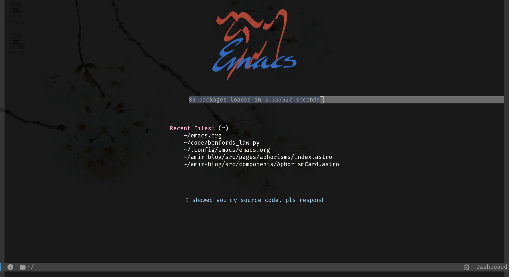

# Amir's Modern Emacs Configuration

 *[optional screenshot]*

A **literate-programming** Emacs configuration that transforms your editor into a:
- Full-featured IDE ✨
- Knowledge management system 📚
- Productivity powerhouse ⚡

## 🚀 Installation

1. Clone this repo to your config directory:

```bash
git clone https://github.com/yourusername/emacs-config.git ~/.config/emacs
